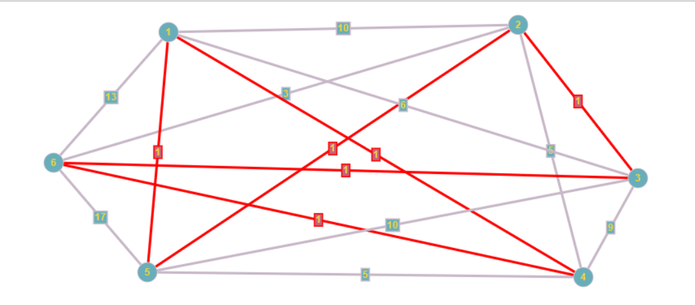
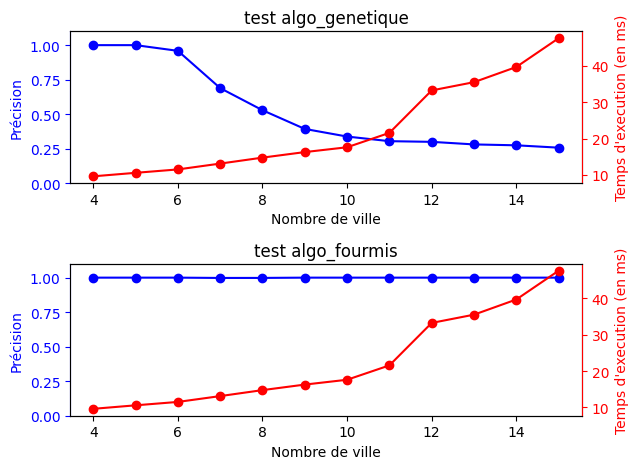

# Voyageur-de-commerce

## Description du projet

Le projet a pour but d'impléménter deux algorithmes permetttant la résolution du problème du voyageur de commerce. Les deux algorithmes implémentés sont l'aglorithme géntique et l'algorithme de la colonie de fourmis.

## Pour lancer le programme

    python3 test.py

## Descriptif de test.py

Le fichier test.py a pour but de ressortir le chemin et la valeur la plus courte des deux algorithmes. Cela va ainsi permettre de comparer les performances de nos deux algorithmes pour un même graphe.
De plus, il est possible de passer un fichier qui va contenir la distance entre les points et ainsi construire la matrice d'adjacence.

Par exemple, pour la matrice d'adjacence donné dans le fichier "mat_adjacence", le graphe ressemblera à ceci:

Le chemin indique le chemin optimal. Il est important de noter que le programme ne renvoie pas d'image et que ce visuel est juste là pour servir d'exemple et pouvoir comparer avec les résultats obtenus pour cette matrice d'adjacence.

## Descriptif du benchmark

Une autre manière de visualiser et de comparer les performances de nos algorithmes est d'utiliser le fichier "benchmark.py" qui va en plus de nous donner les temps d'exécution des différentes fonctions, va nous permettre de pouvoir obtenir des graphes des ddeux algorithmes nous donnant la précision et le temps d'exécution pour un ensemble de villes. Comme par exemple, pour un maximum de 14 villes:

